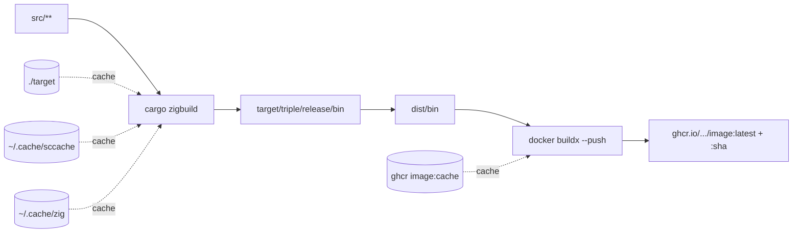

# Cross Build Image 🛞

> **「image を build する場所が、 dev loop の速度を決める。」**

**Core principle:** Rust binary を Docker image にする際、 build を Docker 内 (cargo-chef + GHA cache) でやるか、 host で済ませて binary だけ COPY する (zigbuild + slim runtime) かは **dev loop 速度の上限を決める設計判断**。 GHA cache 10 GiB 制限と layer hash mismatch から逃れたいなら **host build 一択**、 Mac M-series + zigbuild がその標準形。

## いつ使うか

- Rust workspace の image build に毎回 10 分以上かかっている
- GHA cache が 10 GiB 制限で eviction され、 cook layer が思うように hit しない
- src を 1 行直すだけの PR で deps の re-build が走って待たされる
- multiple Rust workspace で同じ deps を何度も build している (sccache を跨いで効かせたい)
- Docker 内に rust toolchain / protoc / cargo-chef が乗っていて image が太い

## いつ使わないか

- Linux x86_64 上の build server で完結する (host = target、 cross-compile 不要)
- CI 環境のみで build する運用 (host build path の整備コストが上回る)
- 頻繁に push する binary でない (cold build OK な occasional release のみ)
- 複数 OS / Arch を持つ team (各人の Mac セットアップが揃わない)

## 全体像



## Cache 階層 (高速化の効き目順)

| layer | 場所 | 役割 | hit 条件 |
|---|---|---|---|
| sccache | `~/.cache/sccache` (default 10 GB) | rustc invocation 単位の object cache | 入力 .rs + flags が同じ |
| zig cache | `~/.cache/zig` | zig-cc の C/C++ obj cache (aws-lc-rs / openssl-sys 等) | C source + flags 同じ |
| cargo target/ | `./target` | incremental build artifact、 host 永続 | rmtree しない限り永続 |
| cargo registry | `~/.cargo/registry` | crates.io / git deps の source download | crate version 不変 |
| buildx registry | `<image>:cache` tag on ghcr | image layer cache (mode=max で中間 layer 全 push) | Dockerfile + COPY 元同じ |

## Build pipeline (3 stage)

1. **zigbuild**: `cargo zigbuild --release --target x86_64-unknown-linux-gnu --package <pkg> --bin <bin>`
   - zig-cc が cross-linker として cargo に注入される (zigbuild の本質)
   - Mac の host ld は Mach-O しか吐けないので zig-cc に挿げ替えて linux/amd64 ELF を出す
2. **stage**: `cp target/<triple>/release/<bin> dist/<bin>`
   - `.dockerignore` で `target/` 除外を維持するため、 `dist/` に staging
3. **buildx push**: `docker buildx build --platform linux/amd64 --cache-from --cache-to --push`
   - Dockerfile は **slim runtime only** (debian:bookworm-slim + ca-certificates + non-root user + COPY binary + ENTRYPOINT)
   - image 内 build しないので protoc / cargo-chef / rust toolchain 全部削除済

## Slim Dockerfile テンプレ

```dockerfile
FROM debian:bookworm-slim
RUN apt-get update && \
    apt-get install -y --no-install-recommends ca-certificates && \
    rm -rf /var/lib/apt/lists/* && \
    apt-get clean

RUN groupadd --system --gid 10001 app && \
    useradd --system --uid 10001 --gid app --shell /usr/sbin/nologin app

# Mac で zigbuild した linux/amd64 ELF を直接 COPY
COPY dist/<bin> /usr/local/bin/<bin>

USER app:app
EXPOSE 8080
ENTRYPOINT ["/usr/local/bin/<bin>"]
```

## 実装スクリプト

`scripts/build-and-push.sh` を skill に同梱。 env var 全 override 対応:

```bash
# default 動作
./build-and-push.sh

# fleetstage-hq-api 例 (ROOT は cwd、 .mise.toml で 1.95 解決)
PACKAGE=fleetstage-hq BIN=fleetstage-hq-api \
IMAGE=ghcr.io/chronista-club/fleetstage-hq-api \
./build-and-push.sh
```

主要 env (以下を default 値か上書き):

| env | default | 役割 |
|---|---|---|
| `TARGET` | `x86_64-unknown-linux-gnu` | rustc target triple |
| `PLATFORM` | `linux/amd64` | docker buildx --platform |
| `PACKAGE` | (必須) | cargo --package |
| `BIN` | (必須) | cargo --bin + dist/ filename |
| `IMAGE` | (必須) | ghcr full image name (without tag) |
| `DOCKERFILE` | `Dockerfile.<BIN>` | -f flag |
| `RUSTC_WRAPPER` | `sccache` | cargo の rustc wrapper |

## Prereq (一度だけ install)

```bash
brew install cargo-zigbuild zig sccache
rustup target add x86_64-unknown-linux-gnu
gh auth token | docker login ghcr.io -u <user> --password-stdin

# .mise.toml で workspace 別 rust toolchain 上書き (グローバル mise 触らない原則)
echo '[tools]\nrust = "1.95"' > .mise.toml
```

## 罠 (踏みやすい)

| 罠 | 症状 | 対策 |
|---|---|---|
| **mise shim 未通過** | `error: rustc 1.94 is not supported` (workspace は 1.95 要求) | script 冒頭で `export PATH="$HOME/.local/share/mise/shims:$PATH"` |
| **pipefail + tee** | cargo 失敗が tee の exit 0 で隠れて成功と誤判定 | log 末尾を `tail -5 \| grep error` で confirm |
| **.dockerignore で target/** | Dockerfile の `COPY target/...` が空 context で失敗 | `dist/` に stage する pattern (target/ 除外維持) |
| **rustls 0.23 CryptoProvider** | runtime panic (build は green、 deploy 後に発症) | `aws_lc_rs::default_provider().install_default()` を main 冒頭で |
| **provider 不一致** | process 内に複数 provider install されて panic | 上流 (例: surrealdb) と provider 揃える、 ring と aws-lc-rs 混合不可 |

## decision matrix (cargo-chef path との比較)

| 観点 | Mac zigbuild path | Docker cargo-chef path |
|---|---|---|
| 初回 build | 5-15 分 (deps cold compile) | 25-30 分 (Docker 内 deps + cargo-chef cook) |
| src-only 変更 | **数十秒** (sccache + cargo target hit) | 1-3 分 (cook layer hit) |
| Cargo.toml 変更 | 1-3 分 (sccache partial + cargo recompile) | 25-30 分 (cook layer miss → full re-cook) |
| Cache 上限 | host disk (実質無制限) | GHA cache 10 GiB |
| Cache 共有 | sccache で全 workspace 跨ぎ | scope 単位で分離、 workspace 間共有不可 |
| 環境再現性 | host 依存 (mise + brew で揃える) | Docker 内で完結、 CI でそのまま動く |
| image サイズ | slim (~50 MB) | thick (~200-400 MB) |
| Mac/Win dev | ✅ (zigbuild が cross-compile) | ✅ (Docker buildx の qemu) |
| CI 統合 | host 整備コスト | そのまま GH Actions OK |
| 推奨 | dev loop / 頻繁 push / Mac M-series 環境 | release / 多人数 / CI 専用 |

## 関連 memory (chronista canon)

- `feedback_cross_compile_locally.md` — 「Rust release build は local cross-compile」上位原則
- `project_unison_buffa_protoc.md` — buffa-build が host protoc を呼ぶ (zigbuild path でも brew protoc 必要)
- `project_rustls23_cryptoprovider_trap.md` — wss 接続の rustls 0.23 罠
- `project_mac_zigbuild_image_loop.md` — fleetstage 内での参考実装と運用知見

## 参考実装

- `~/repos/fleetstage/scripts/build-and-push-hq-api.sh` — fleetstage-hq-api 用の wrapper
- `~/repos/fleetstage/Dockerfile.hq-api` — slim Dockerfile (ca-certs + non-root + COPY binary だけ)
