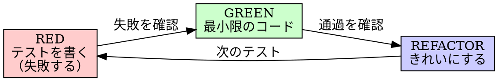

# Test-Driven Development (TDD)

> **テストを先に書け。失敗を見ろ。最小限のコードで通せ。**

**Core principle:** 失敗を見ていないテストは、正しいものをテストしているか分からない。

**ルールの文言を破ることは、ルールの精神を破ることだ。**

## いつ使うか

**常に:**
- 新機能の実装
- バグ修正
- リファクタリング
- 振る舞いの変更

**例外（ユーザーに確認）:**
- 使い捨てプロトタイプ
- 自動生成コード
- 設定ファイル

「今回だけTDDスキップ」と思った？ それは合理化だ。

## The Iron Law

```
テストが先に失敗しない限り、プロダクションコードを書くな
```

テストより先にコードを書いた？ 削除しろ。最初からやり直せ。

**例外なし:**
- 「参考として残す」→ ダメ
- 「テスト書きながら調整する」→ ダメ
- 「チラ見するだけ」→ ダメ
- 削除は削除

テストからフレッシュに実装しろ。以上。

## RED-GREEN-REFACTOR サイクル



### RED - 失敗するテストを書く

1つの振る舞いを表す最小限のテストを書く。

```typescript
// 良い例: 明確な名前、実際の振る舞いをテスト
test("3回リトライして成功する", async () => {
  let attempts = 0;
  const operation = () => {
    attempts++;
    if (attempts < 3) throw new Error("fail");
    return "success";
  };

  const result = await retryOperation(operation);

  expect(result).toBe("success");
  expect(attempts).toBe(3);
});
```

**要件:** 1つの振る舞い、明確な名前、本物のコード（モックは最終手段）

### RED確認 - 失敗を見る

**必須。絶対にスキップするな。**

```bash
bun test path/to/test.test.ts
```

確認:
- テストが**失敗する**（エラーではなく失敗）
- 失敗メッセージが期待通り
- 機能未実装が原因で失敗（タイポではなく）

テストが通る？ → 既存の振る舞いをテストしている。テストを修正。

### GREEN - 最小限のコード

テストを通す最もシンプルなコードを書く。

```typescript
// 良い例: テストを通すのに十分なだけ
async function retryOperation<T>(fn: () => Promise<T>): Promise<T> {
  for (let i = 0; i < 3; i++) {
    try {
      return await fn();
    } catch (e) {
      if (i === 2) throw e;
    }
  }
  throw new Error("unreachable");
}
```

テスト以上の機能追加、他コードのリファクタ、「改善」は禁止。

### GREEN確認 - 通過を見る

```bash
bun test path/to/test.test.ts
```

確認: テスト通過、他テストも通過、出力がクリーン。

### REFACTOR - きれいにする

GREENの後のみ: 重複除去、命名改善、ヘルパー抽出。テストは常にGREEN。振る舞い追加禁止。

## 合理化を見破る

| 言い訳 | 現実 |
|--------|------|
| 「シンプルすぎてテスト不要」 | シンプルなコードも壊れる。テストは30秒。 |
| 「後でテスト書く」 | 後から書いたテストは即座に通る。それは何も証明しない。 |
| 「手動テスト済み」 | アドホック ≠ 体系的。記録なし、再実行不可。 |
| 「参考として残す」 | 見ながら書いたらテスト後書きと同じ。削除は削除。 |
| 「TDDは教条的」 | TDDは実用的。デバッグより速い。 |
| 「X時間の作業を捨てるのは無駄」 | サンクコストの誤謬。信頼できないコードこそ無駄。 |

## Red Flags - 止まってやり直せ

- テストより先にコードを書いた
- テストが即座に通った
- なぜ失敗したか説明できない
- 「今回だけ」と合理化している
- 「手動テスト済み」と言い張っている

**すべて = コードを削除。TDDでやり直し。**

## バグ修正の例

**バグ:** 空メールが受け入れられる

**RED:**
```typescript
test("空メールを拒否する", async () => {
  const result = await submitForm({ email: "" });
  expect(result.error).toBe("メールアドレスは必須です");
});
```

**RED確認:** `FAIL: expected 'メールアドレスは必須です', got undefined`

**GREEN:**
```typescript
function submitForm(data: FormData) {
  if (!data.email?.trim()) {
    return { error: "メールアドレスは必須です" };
  }
  // ...
}
```

**GREEN確認:** `PASS`

**REFACTOR:** 複数フィールドのバリデーション抽出（必要なら）。

## 完了チェックリスト

- [ ] すべての新機能/メソッドにテストがある
- [ ] 各テストの失敗を目視で確認した
- [ ] 各テストが期待通りの理由で失敗した
- [ ] 各テストに最小限のコードで通した
- [ ] 全テスト通過
- [ ] 出力がクリーン（エラー・警告なし）
- [ ] エッジケース・エラーケースもカバー

全部チェックできない？ TDDをスキップした。やり直せ。

## creo-memories 連携

重要なテスト戦略の決定は creo-memories に記録を推奨:
- テスト設計のパターンや学び
- モック戦略の決定と理由
- テスト困難だった箇所と解決策

> **t-wadaに突っ込まれないテストを書く。**
> テストの価値は「通ること」ではなく「失敗で問題を教えてくれること」。
